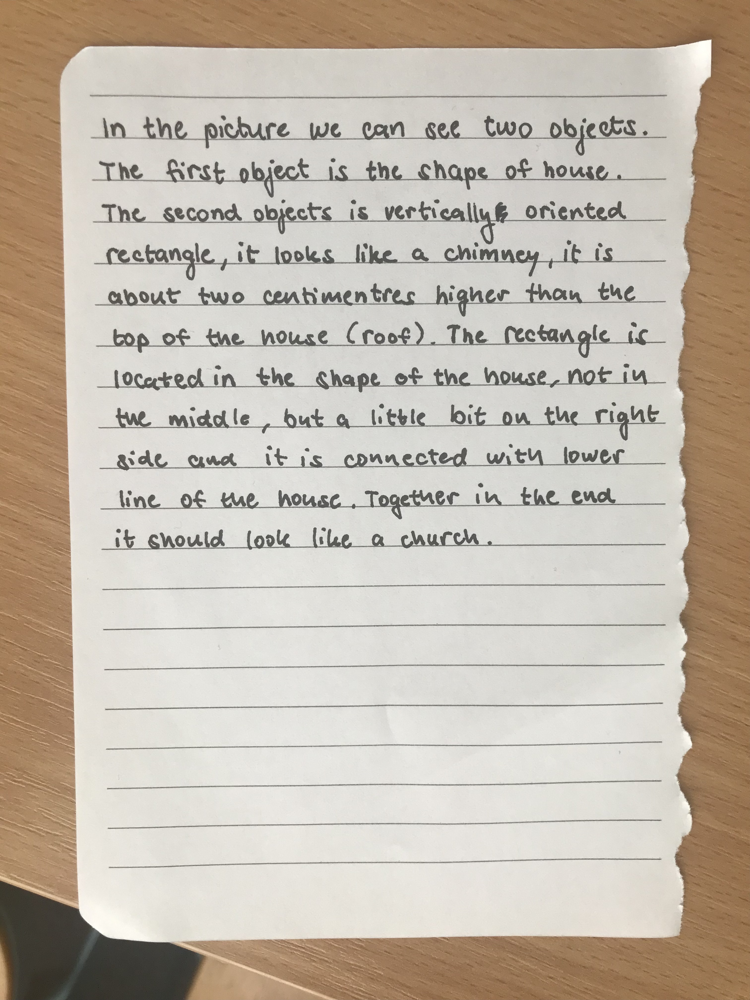

# english
# The icebreaker
## _instructions_
Imagine that you have to describe an image you've got to someone who can't see it. Describe everything you see – objects, shapes, sizes, colors, lines, orientation, location, etc. – and other person will try to draw it with the help of your instructions without seeing the image.

## Image description:
Draw it and have fun! :)

There are 2 objects
1. The first object looks like the shape of a house
– about 6 cm wide and 5 cm high 
2. The second object is vertically orientated rectangle
– about 2 cm wide, 7 cm high and it is higher than the top of the house's roof
– the rectangle is located in the shape of the house, not exactly in the middle, but a little bit on the right side and it is connected with a lower line of the house

Altogether in the end it reminds a church or some building.

## Here is the final image:

## Is it similar? :)
