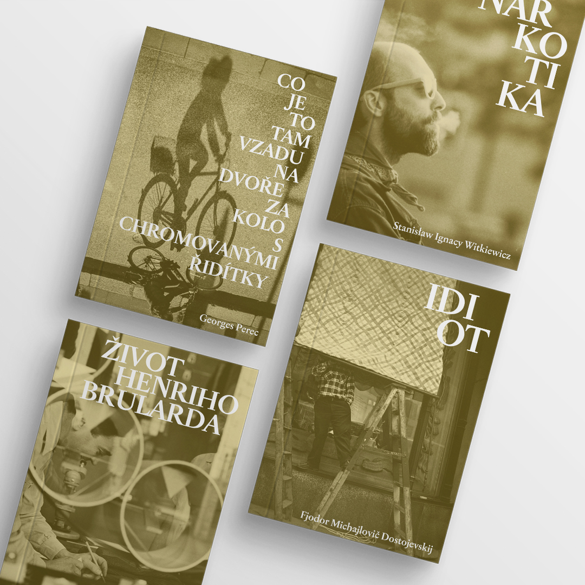
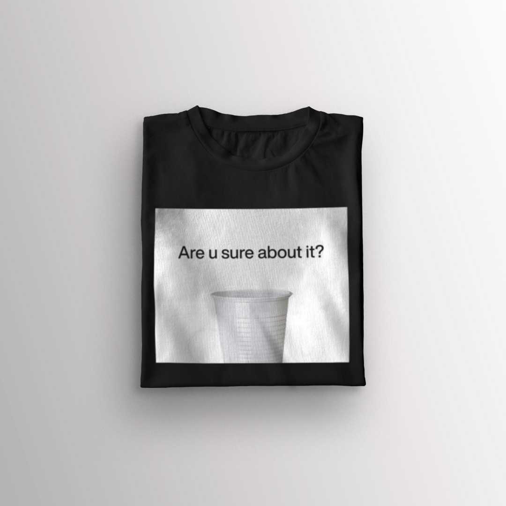
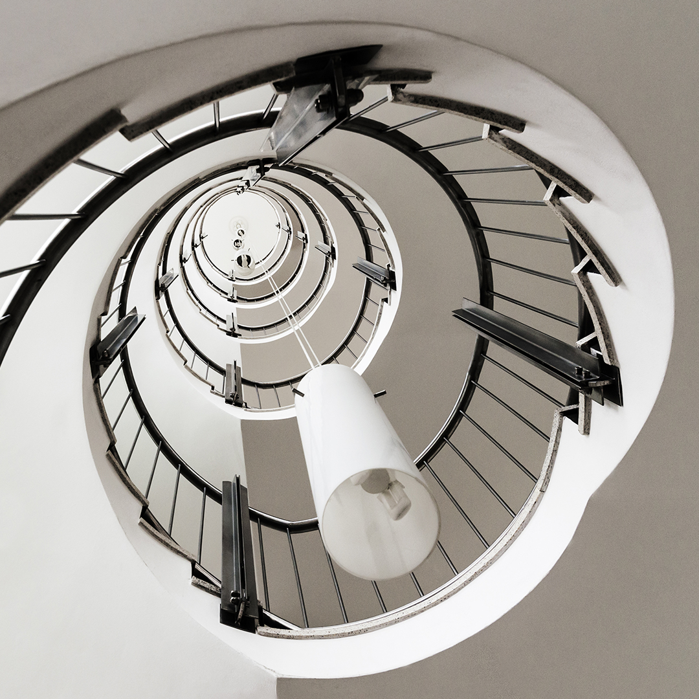
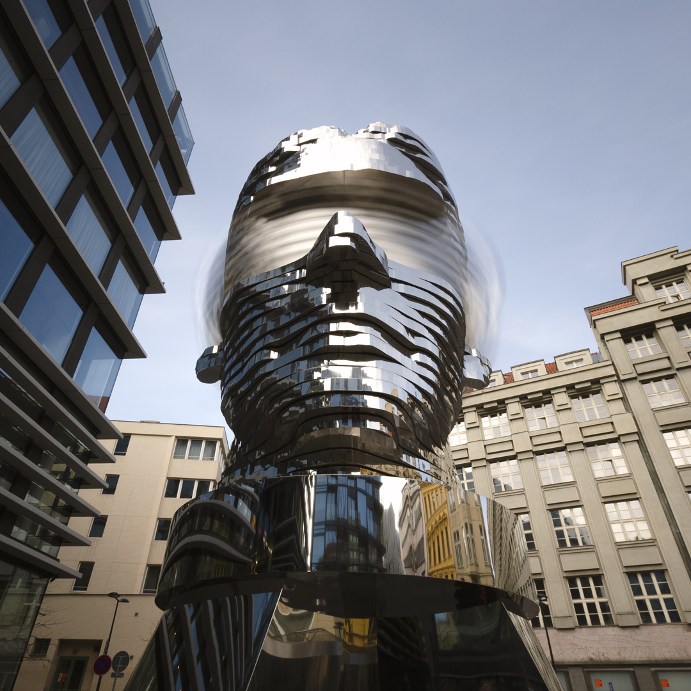
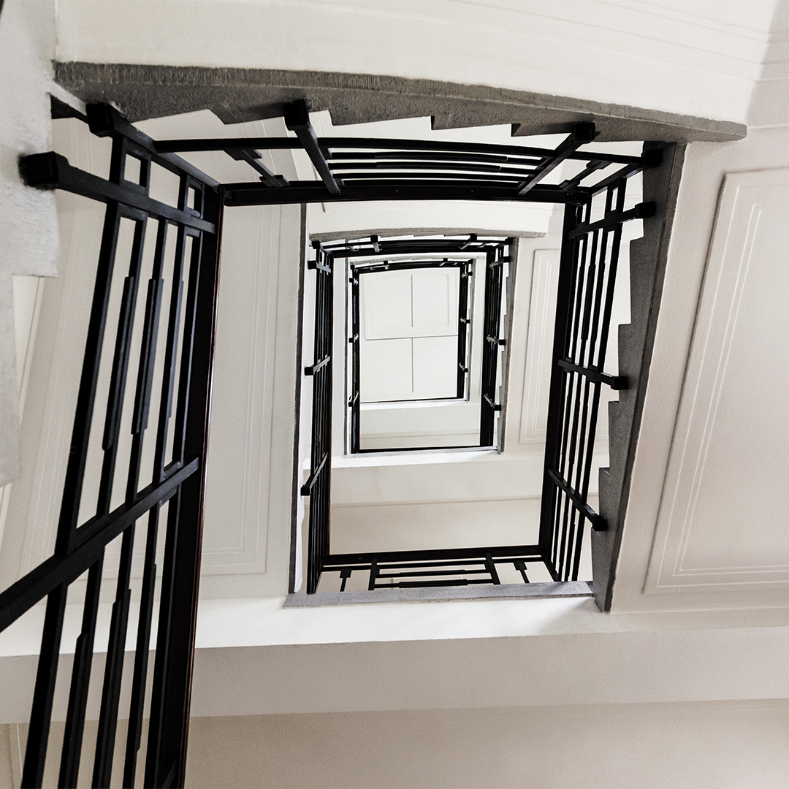
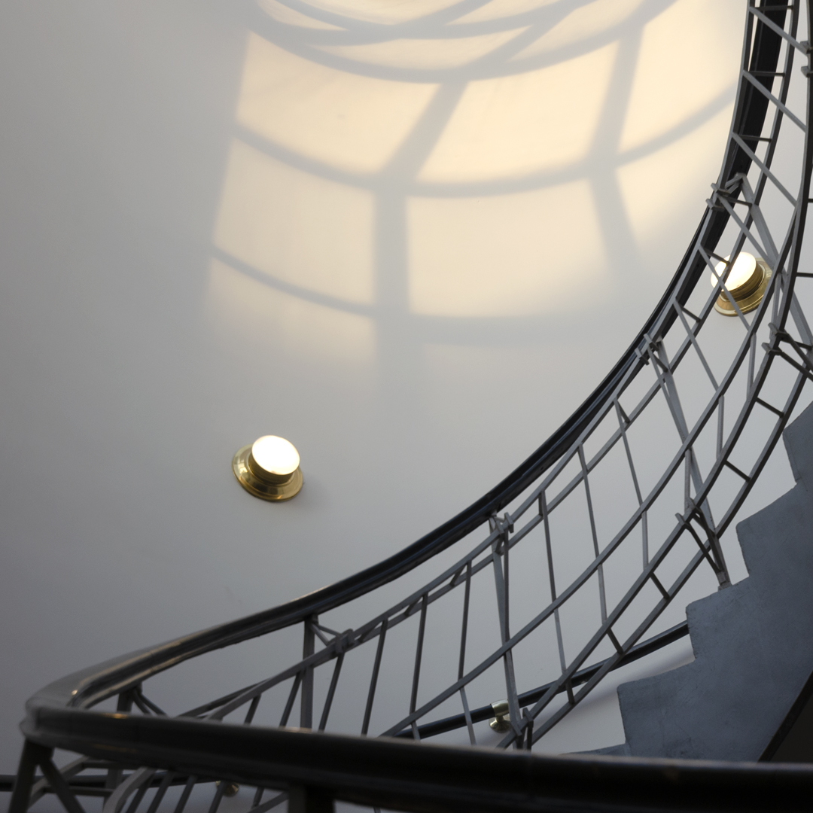
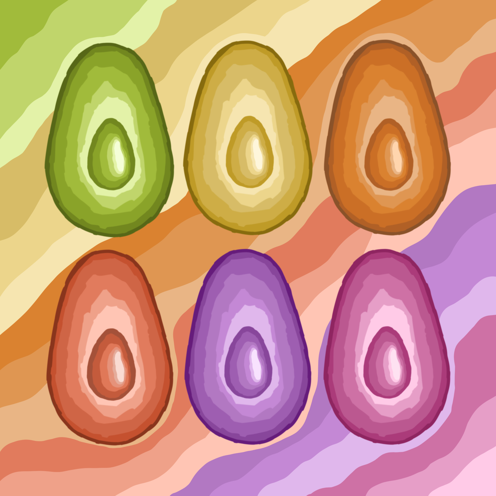
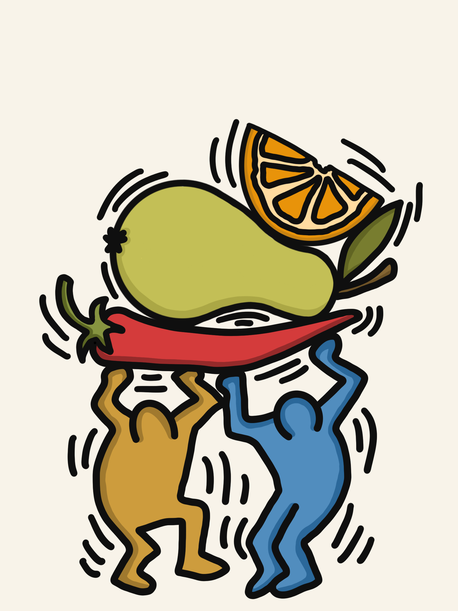

# Impression

## My favorite portfolio pieces

### Cover design of a book edition

**Alt text:** Mockup showing a cover design of a book edition.

The first photo with a bicycle shadow was taken by Marco Larousse. Both photos on the bottom were taken by Vivian Maier.

Source of the mockup <a href="https://www.freepik.com/psd/cover">Cover psd created by xvector - www.freepik.com</a>

### What's bothering me?

**Alt text:** T-shirt mockup with a printing of a white plastic cup and question 'Are u sure about it?'.

Source of the t-shirt mockup <a href="https://www.freepik.com/psd/mockup">Mockup psd created by Vectorium - www.freepik.com</a>

### Some of ordinarily unordinary moments or things captured in my life

### Imitations of styles, Andy Warhol and Keith Haring

**Alt text:** Imitation of Warhol style, colorful avocados.

**Alt text:** Imitation of Keith Haring style, two characters bearing orange, pear and chili pepper.

### That's all, thanks for watching
