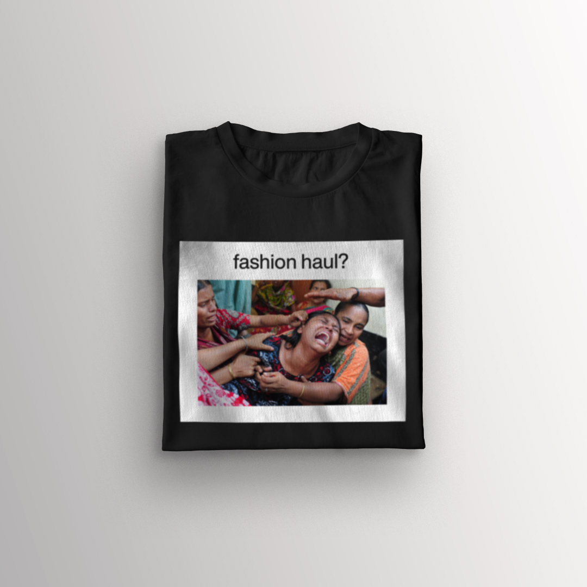

# Impression

## My favorite portfolio pieces

### Cover design of a book edition
Popis ukolu???

**Alt text:** Mockup showing a cover design of a book edition.

The first photo with a bicycle shadow was taken by Marco Larousse. Both photos on the bottom were taken by Vivian Maier.

Source of the mockup <a href="https://www.freepik.com/psd/cover">Cover psd created by xvector - www.freepik.com</a>

### What's bothering me?
popis úkolu???

**Alt text:** T-shirt mockup with a printing of a white plastic cup and question 'Are u sure about it?'.

Source of the t-shirt mockup <a href="https://www.freepik.com/psd/mockup">Mockup psd created by Vectorium - www.freepik.com</a>

**Alt text:** T-shirt mockup with a printing of a photo captured during the Rana Plaza factory collapse in 2013 and a sarcastic question: 'Fashion haul?'.

Source of the photo http://projects.aljazeera.com/2015/08/rana-plaza/childrens-place.html

### Some of ordinarily unordinary moments or things captured in my life
popis???

