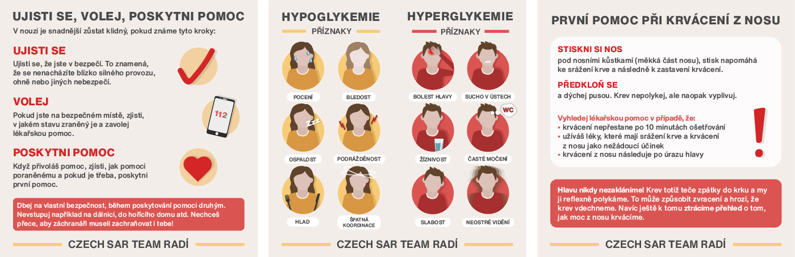

# Educating cards for Czech SAR Team
## What is Czech SAR Team?
Czech Search and Rescue Team is a component of the Integrated Rescue System.
Their main activity is the searching for people, who are missing or lost throughout the Czech Republic.
## What

Alt text:

Alt text:
