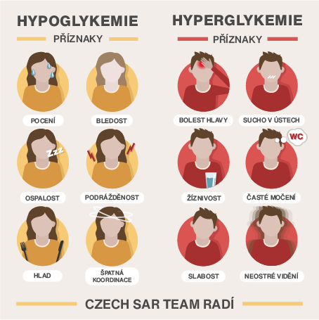

# Educating cards for Czech SAR Team
## What is Czech SAR Team?
Czech Search and Rescue Team is a component of the Integrated Rescue System.
Their main activity is the searching for people, who are missing or lost throughout the Czech Republic.
## Brief
Required only 
- make educating cards for instagram according to an assignment
- use yellow and red colors
- use a sentence: Czech SAR Team advises 

## Color palette

## The first card
Symptoms of hypoglycemia and hyperglycemia

## What do the final cards look like? 

Alt text:

Alt text:
