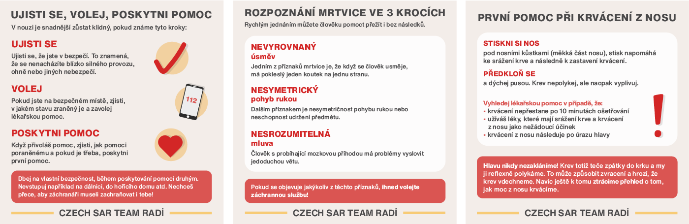
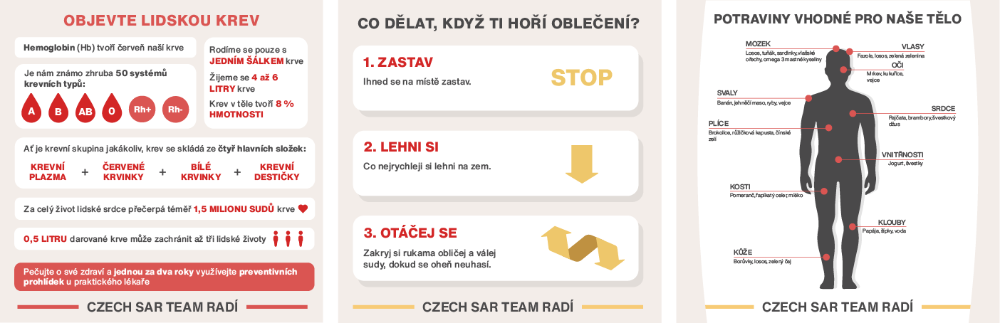

# Educating cards for Czech SAR Team
## What is Czech SAR Team?
Czech Search and Rescue Team is a component of the Integrated Rescue System.
Their main activity is the searching for people, who are missing or lost throughout the Czech Republic.
## Brief
Educating cards for Instagram according to an assignment – _for example cards about a human body, first aid, symptoms of diseases, etc._

Required only 
- use yellow and red colors
- use a sentence: Czech SAR Team advises 

## Color palette
I used colors they have on theirs uniforms, but in a softer tones.

## The first card
- Symptoms of hypoglycemia and hyperglycemia

## What do the other final cards look like? 

- how to proceed when an accident occurs, stroke detection in three steps, what to do when your nose is bleeding

- interesting facts about human blood, what to do when your clothes are on fire, what food is suitable for different parts of the body 
