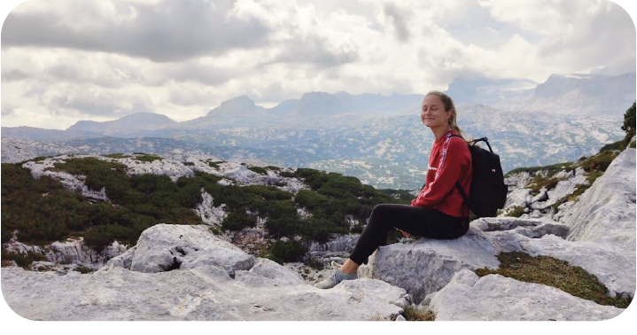

# Tereza Hrachovcová
## About me 
Hey, I am Tereza – right now student of a graphic design, and seeker of myself.

## My story

In my whole life I have never been completely sure about my future. The first notification came when I had to decide what high school I want to study. Someone once told me that I have always been the person who is behind the camera, not in the viewfinder. I took it as a sign and decided to study a photography. It was a right choice because I fell in love with analog photography. Then (again) came another decision making. Somehow I started study a one year language course of english. And here we are again, after the finishing the english course the crazy sign in my head 'loading your decision...' showed up.
 
So now I am here, studying third and last year of graphic design at VŠKK, telling myself what the f are u doing here. Thinking about what if I don't belong in here.

But you know what?  Maybe life is about not knowing. About seeking the right way for us. And I can finally say outloud that it's not wrong to not find it, the most important is the journey.

And that's my story. 

And if you are asking what am I like or what I enjoy to do. I like a book design, reading, writing, making a macrame decorations and I enjoy trying to reduce the waste I produce as a human.

[Click to see my case study](case_study.md)

And if u are interested in macrame decorations I make [click here](macrame.md)
