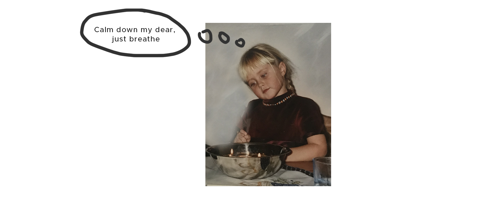
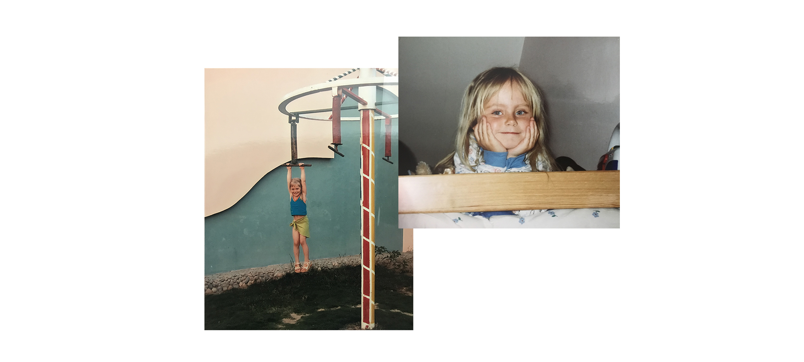
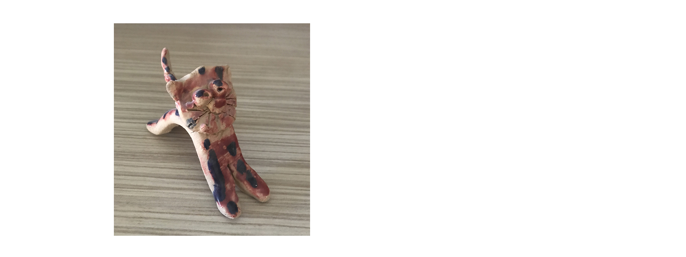
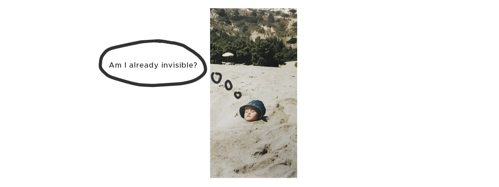
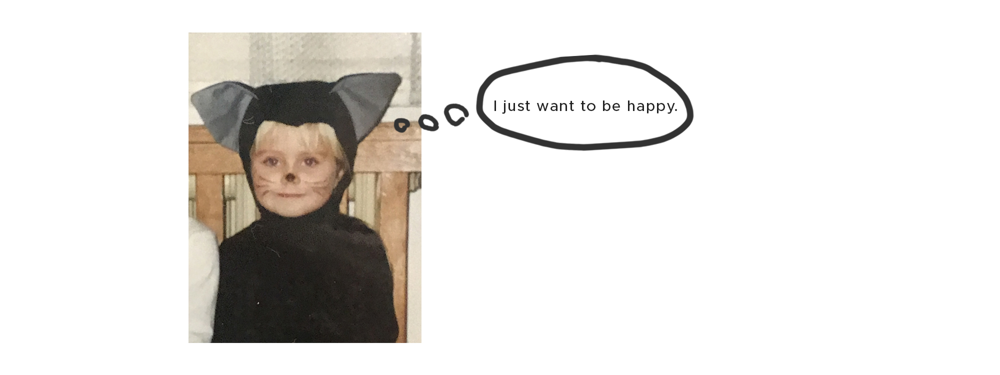

# Hello, I am the most stressed out human being in the whole world. Nice to meet you!
### Design story? Eeeeee...
> Me thinking really hard about my design story.

Let's get back to the age I was still able to relax, the word stress was just a word and only problem I had in my mind was which animal I will make of chestnuts. It was in the kindergaten. Yes, a long time ago. 

> Let me introduce you a 'relaxed me'

When I was a kid, me and my mother did a lot of creative activities and she somehow build a love for creating things in me. I also attended drawing and ceramics club. I remember my first contact with a computer, I was about 8 sitting infront of a big screen and my dad was explaining me what is Google, that I can search some pictures of princesses and fairies here (:DDD).

> For example this is one of my ceramics works I made in 7 years. I was proud of myself. Funny right? Now I can't find that type of feeling.

The older I got the more I knew that making a decisions is not my style and that I am really really really stressed about everything what is going on in my life. And when I say everything it is truly everything. Phone calls, exams, presentations, changes, future, first rehabilitation visit, doctors, dentists, being photographed, going into sea in case of a shark would cut off my leg, that a spider would attact me when I am sleeping and so on... :DDD
But the most hardest thing for me I am stressed about is speaking about myself, because in these days is almost forbidden to say a sentences like I don't know who I am, I don't know what to do with my future. From all of us is expected to know it. And if there is someone who don't, something went wrong. 
> I have to stop blabbing, let's get back to the story. (Funny fact: All that I would never say outloud)

#### Hello, I am decision no. 1. Are you ready? Nah. Whatever. “What high school do you want to study?”
That was my first important moment to decide about my future. Someone once told me that I have always been the person who is behind the camera, not in the viewfinder (since I was 10, I hate being photographed). I took it as a sign and decided to study a photography. It was a right choice because I fell in love with analog photography. At high school I was also attending lessons of graphic design and that was my first step to it. 
#### Decision no. 2 “What do you want to do after high school?”
Somehow I started study a one year language course of english. When I started I was telling myself: “I have one year to find out who I am as a human. It is a pile of time!” 
Truth is that it wasn't plenty of time. And here we are again, after the finishing the english course the crazy sign in my head 'loading your decision...' showed up. The english course took a place in the same building as VŠKK, so that was the first step closer. The teacher once asked me if I am going to continue in here and try to sign up for this university. I told him that I don't think so. And here we are...
#### Decision no. 3 “What do you want to do after a language course?”
Now I am studying third and last year of graphic design at VŠKK, telling myself what the f are u doing here, you don't belong in here. But I already know that my life is about not knowing and about getting to know myself. I have always love reading books (surprisingly, because it is a silent activity and I don't have to speak) and thanks to the university I know that I (I can't say love, it will be explained in a moment) like a book design.
#### Decision no. 4 “What do you want to do now?”
> Me stressing about not knowing the answer, ignoring that question and stressing about ignoring it. 

I would say that I am that type of a kid that would answer something like:

#### So what does graphic design mean to you? Will you finally tell us the design story instead of this?
I would be lying if I would say something like...
> Graphic design is my biggest passion. I am thinking about it right after waking up and during brushing my teeth, I am having a breakfast, lunch, snack and dinner with Illustrator on my screen and when I am sleeping, I am dreaming about it. 

- It would be nice like that, but that's not true. And I am sorry world, I can't hate myself for it. 

I have never been a person who loves talking and talking to people, presenting oneself or their work and these things. Be known and visible. This is not what I want.
I know it is important for this specifications but also I know it can be done without it. Every human prefers something else. I am the one who want to silently do my job and be happy. I like about it the opportunity, that it can be done almost silently and that something can speak instead of me.

#### So if you were looking for a design story, I am sorry but you wasted 10 minutes.
