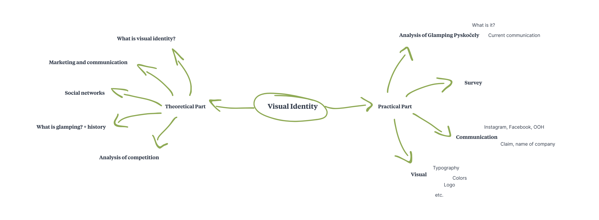

# Clarity first
- [Summary](#summary)
- [Mind Map](#mind-map)
- [Keywords](#keywords)
- [Key Points](#key-points)
- [References](#references)

# Visual Identity of a project called Glamping Pyskočely

## Summary
In my thesis I will redesign an identity for Glamping Pyskočely, the project providing an accommodation in a glamping style. This way the word 'glamping' will be known pro more people.

  
<b>Mind Map</b>

  

## Keywords

- **Visual identity**
  - …
- **Glamping**
  - camping accompanied by comfort things
- **Graphic design**
  - …
- **Visual communication of accommodation**
  - …
- **Keyword**
  - …

## Key Points
**Background/importance of topic:** Visual identity for a project Glamping Pyskočely.

**Purpose/hypothesis (thesis or statement of problem):**
 I think the company has a big potential, but they don't use any corresponding visual style. They also 
don't use much a social media or any advert and I would like to mention what could be improved.

**Research — design/methodology/approach including procedures/data/observations:**
I was studying four competitive accommodations. Three from Czechia, two from abroad. I was concentrated on their design, communication on Instagram and Facebook, if they
use a blog or what they are using to be more visible. I also have a survey where I found out that my target group are people from 18 to 34 years and mostly partners or also families with a small children.

**Findings (highlight outcome of research):** 
?

**Conclusions (significance/success of study to theory/practical/society):**
?

## References

- [The history of glamping.](https://firelightcamps.com/blog/2018/10/2/the-history-of-glamping)
- KAFKA, Ondřej a KOTYZA, Michal. Logo & corporate identity, 2014
- …

# School task
## What is the problem of your thesis? 
The company don't use any corresponding visual style. They also don't use much a social media 
or any advert and I would like to mention what could be improved. Also the word 'glamping' is 
almost unknown and it would be great to introduce it to people.

## How are you going to solve it?
I was comparing competitive accommodations, mostly from Czechia, but also abroad. I was concentrated on their designs, communication on Instagram and Facebook, if they
use a blog or what they are using to be more visible. I also have a survey where I found out that my target group are people from 18 to 34 years and mostly partners or also families with a small children.

## Why do you know it will be succesful?

