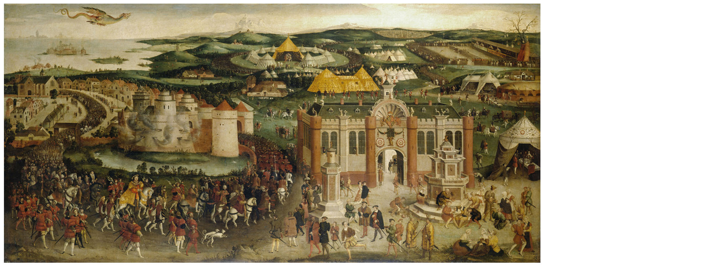
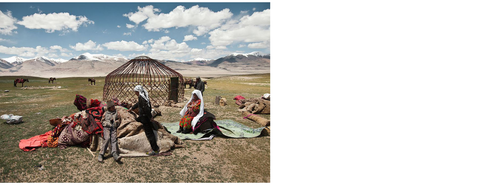
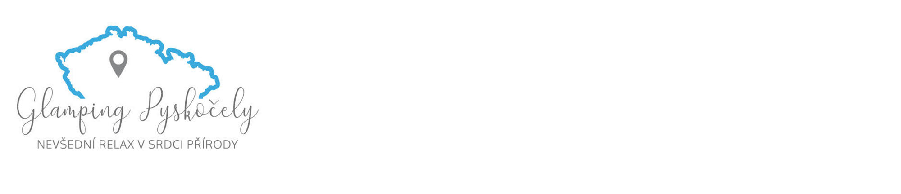
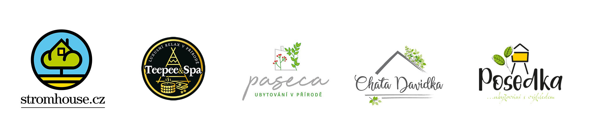
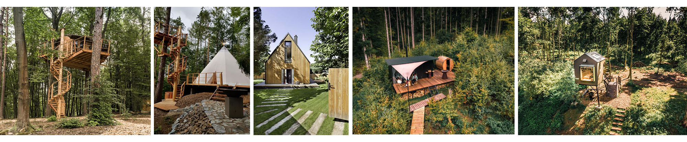
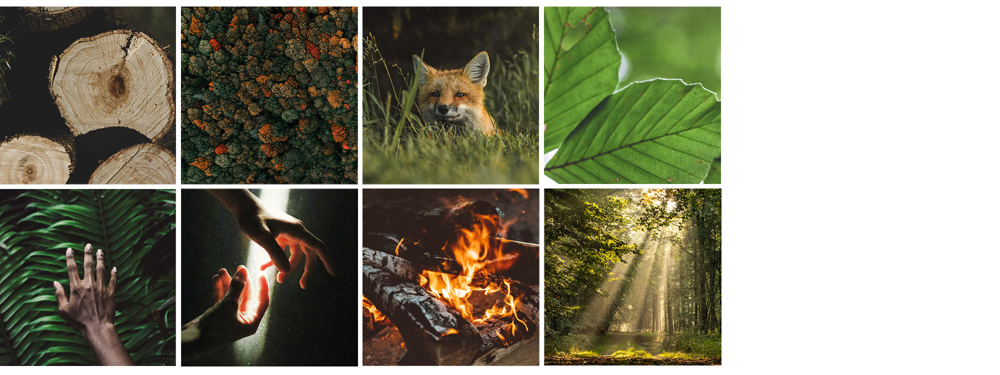
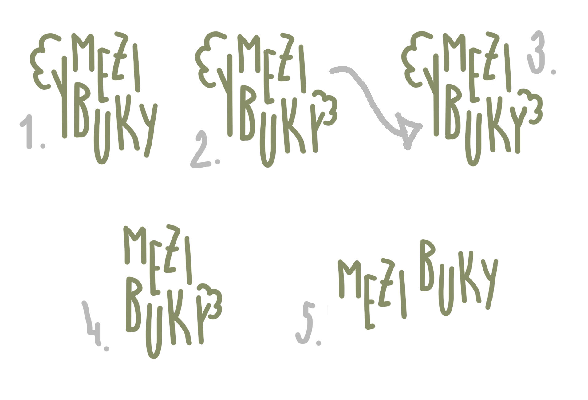

# Visual identity of a company Glamping Pyskočely

## Abstract
By redesigning an identity for Glamping Pyskočely I would like to spread the word 'glamping' to more people and point out that camping can be done in another, more comfortable way. Also with a new identity I would like to express the right mood of this company.

## Keywords
Visual identity, glamping Pyskočely, glamping, graphic design, visual communication of an accommodation

## Presentation
Glamping Pyskočely – visual identity
#### Brief history of the glamping:
> The word glamping appeared in English around 2005, in the Oxford Dictionary in 2016. However, the history of glamping dates back to the time when European kings didn't sleep in a tent on the ground during trips to diplomatic meetings and military expeditions. 

During the meeting of Henry VIII. and Francis I. in the north of France were build about 2,800 tents, some were decorated with gold, red wine and beer flowed from the fountains around and Henry's tent had an area of about ten thousand square meters. Also the Ottomans took a group of craftsmen on military missions to take care of the construction of their palace tents.

The nomadic tribes lived in yurts, circular tents providing protection from strong winds. The yurts were made of light material and construction, so they were easy to carry so it allowed the tribes to move according to their needs.

Glamping was also fueled by the event in 1903, when President Theodore Roosevelt went on a trip with conservationist John Muir to Yosemite National Park, which popularized camping. 

#### Current visual identity
> Logo of Glamping Pyskočely

> Logos of accommodation in Glamping Pyskočely

#### Moodboard
Supporting the idea of a glamping accommodation, the feeling of nature, smell of a starry nights in summer, mood during the stay – freedom, unification, ease, presence, being

#### Brand name
> Original name of the company is **'Glamping Pyskočely'**. 

I wanted to express the nature in the name because like we know, almost nobody knows the word glamping and people can't connect it with nature. So I decided not to use this word and express it in a different way so I changed the name to **'Mezi buky'**. Translation to english is something like **'among/between the beech trees'**. The reason is that in colony where the houses lies are more than 250 years old beeches. The word ‚mezi‘/‘among‘ can symbolize the border between world where everyone hurry somewhere and the world/place where people can concentrate on themselves, on their loved ones and presence.

#### Logo sketches
The logo should express the feeling of nature. I would like to find a font which is narrow and long to capture the tree, as they are long and narrow. Also letters are not in the same line as the forest. Trees aren’t in one line in a woods too. 

> Sketch no. 2 – the problem is that the letter Y and the tree on the left are based on the same principle so it is confusing and it looks like there are two letters Y. So I tried to change the Y to look different, sketch no. 3

