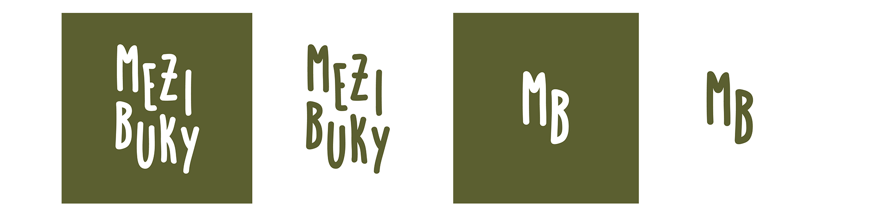
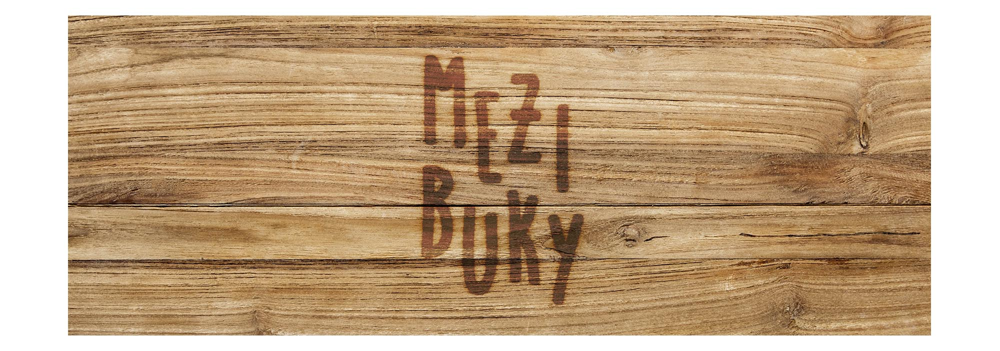
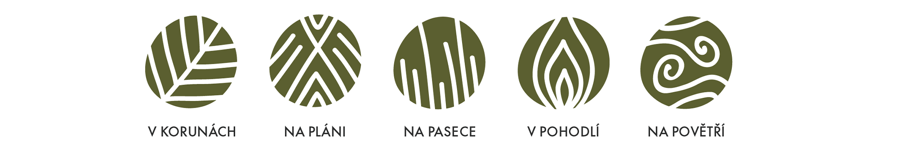
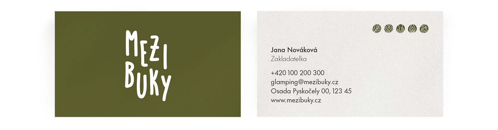
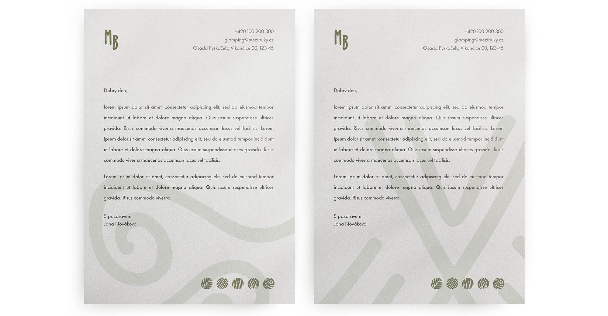
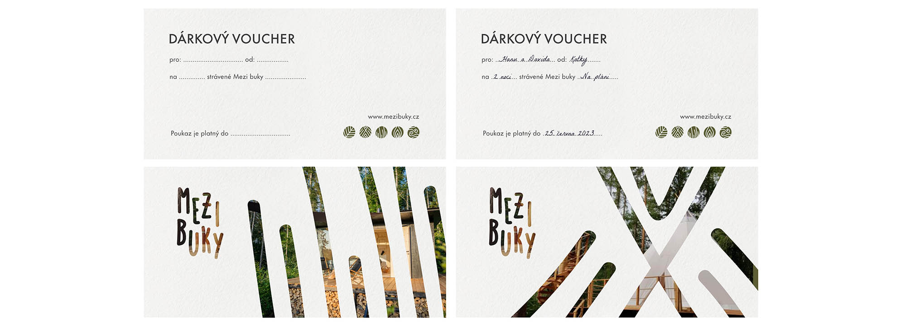
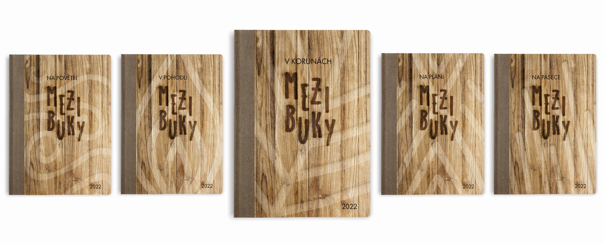
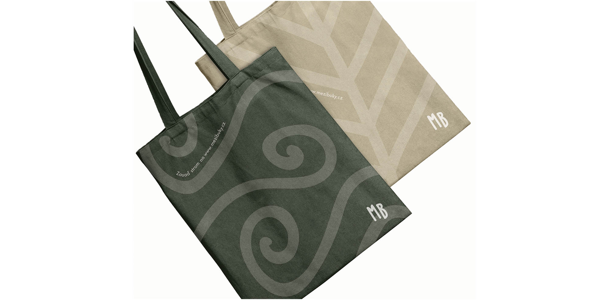
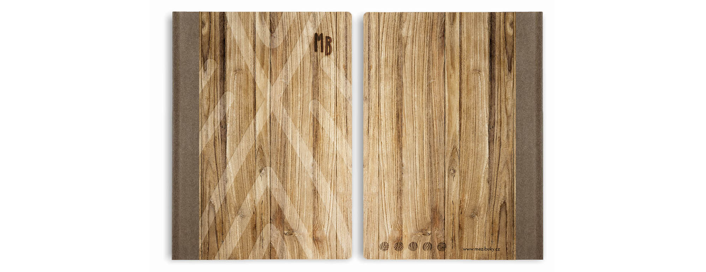

# Bachelor thesis
# Visual identity of Glamping Pyskočely
### Abstract
This bachelor thesis focuses on changing the visual identity of Glamping Pyskočely. The work aims to united corporate identity and visual communicatuon. The communication is corresponding with the company's philosophy. Also with a new design I would like to express the right mood of this company. By redesigning their identity I would like to spread the word 'glamping' to more people. Point out that people can experience camping in another, more comfortable way. 

The theoretical part deals with the research about creating a new corporate identity. It explains what is glamping, its brief history and analysis of competing companies. 

The practical part is about introducing the company and its current visual communication. Then I am introducing new philosophy, communication channels and the final visual style.

# Communication
## Instagram 
My main goal at Instagram is to increase activity and gain new followers. It could be by sharing internal events, news or organizing competitions. To distinguish the content of individual accommodations I am going to use a story folders. When it comes to content sharing, the ability with more photos in one post distinguish it with the first image.

I would also like to include in the profile:
- Quizzes - in this way it is possible to educate people in any topics. The questions may refer to podcasts and include topics that are covered in them. They may also relate to anything related to nature and company. Quizzes can become a routine and share a series of questions once per a week. People would have a reason to return to profile.
- Influencers - I would definitely choose influencers who like to travel and share it with their followers. Their target group should be the same as the the company is aiming for. Also they should have a positive attitude towards nature. Selected influencers would choose one type of accomodation. During the stay they would make a vlog or several videos and photos on instagram stories. They could also write their feelings in one post.
- Hashtags - Promoting certain hashtags could help increase visibility. I would recommend using always the same set. Customers find them in the same place as before and it targets the same audience all the time. It helps with building a closer community. It is userful to add hashtags also in the stories, people can then view the stories below them.

## Blog
I would include a blog in the communication. It can include ecology articles, trip tips or stories about the company. People could learn more about the project behind the scenes on the blog. For people who prefer to read rather than listen, a podcast could be turned into a written version. Also influencers could write a short articles about their stay. Share their experiences and feelings about accommodation. 

## Podcast
I would use podcasts for more detailed information and education.
The podcast would include topics about nature and information about the company. They could invite guests in the podcast. For example people who understand the topic professionally or visitors who visited Mezi buky. Sharing their stories could attract other customers.

Examples of topics:
- What is glamping
- The history of glamping
- The story of Mezi buky
- Which organizations the company supports
- How to help forests as an individual and so on

To the podcast could be added acoustic episodes with sounds that guests may hear at Mezi buky (sounds of birds, crackling of fire, owls, frogs, crickets, etc.). These sounds are relaxing, soothe and helps sleep better. At the end of some eposodes could be a competition for discounts or some bonuses. 

### Logo

### Symbols for houses
To mark individual accommodation, I decided to use symbols, which should help for better orientation. Each of the symbols shows something what dominates the style of accommodation. The symbols are inserted in an irregular wheel. It sticks to simplicity and one line.
- **V korunách** → This accommodation is located among the treetops, so I chose the leaves as a symbol.
- **Na pláni** → Teepee is the original dwelling of the Great Plains Indians, as a symbol I used the shape of the teepee, which in the end resembles Indian's patterns.
- **Na pasece** → On many pastures predominate rough grasses, so I decided to show them as the symbol.
- **V pohodlí** → Since this accommodation is mainly for families with children, I used a fire in the symbol, which refers to the phrase "warmth of home".
- **Na povětří** → This accommodation resembles a place where hunters observe wildlife, it is high, so I chose the wind as a symbol.

### Business card and letterhead

### Voucher

### Guest books
The guest book is beneficial because people write their feelings and opinions about their stay. They can write there what they missed or what they liked. The owner of the accommodation then has the opportunity to listen to his guests and thus convince his customers that he cares about them. I created this book, which aims to connect clients with owners and improve the quality of services. The logo is burnt on wooden boards. Each accommodation have its own book, so they are distinguished with patterns. 

### Wayfinding signposts

## Merchandising
### T-shirts
Part of the profit from the T-shirts would help organizations that take care of nature and forests. For example, Čistý les nebo Zachraňme lesy. I would help to promote the #zachranmelesy hashtag for this organization. 

### Linen bags
Sold linen bags will help with planting new trees. My aim is to not fill the bags with advertising. They are quietly decorated with symbols and a simplified version of the logo is in the right down corner. The website and text 'plant a tree' copies the lines of symbols. 

### Paper blocks

### Tin mugs

