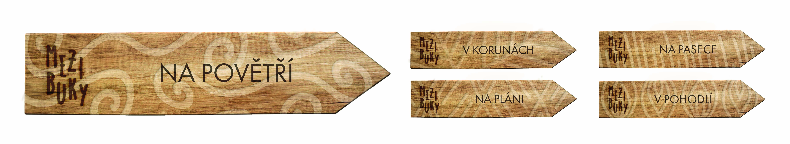

# Bachelor thesis
# Visual identity of Glamping Pyskočely
### Abstract
This bachelor thesis focuses on changing the visual identity of a company Glamping Pyskočely. The work aims to make united corporate identity and visual communicatuon corresponding with the company's philosophy. Also with a new design I would like to express the right mood of this company. By redesigning their identity I would like to spread the word 'glamping' to more people. Point out that people can experience camping in another, more comfortable way. The theoretical part deals with the research about creating a new corporate identity, explaining what is glamping, approximation of a history and analysis of competition. The practical part is about introducing the company and its current visual communication, marketing and a visual style.

### Symbols for houses
To mark individual accommodation, I decided to use symbols, which should help for better orientation. Each of the symbols shows something what dominates the style of accommodation. The symbols are inserted in an irregular wheel. It sticks to simplicity and one line.
- V korunách → This accommodation is located among the treetops, so I chose the leaves as a symbol.
- Na pláni → Teepee is the original dwelling of the Great Plains Indians, as a symbol I used the shape of the teepee, which in the end resembles Indian's patterns.
- Na pasece → On many pastures predominate rough grasses, so I decided to show them as the symbol.
- V pohodlí → Since this accommodation is mainly for families with children, I used a fire in the symbol, which refers to the phrase "warmth of home".
- Na povětří → This accommodation resembles a place where hunters observe wildlife, it is high, so I chose the wind as a symbol.

### Book for visitors
The guest book is beneficial because people write their feelings and opinions about their stay. They can write there what they missed or what they liked. The owner of the accommodation then has the opportunity to listen to his guests and thus convince his customers that he cares about them. That is why I created this book, which aims to connect clients with accommodation owners and thus improve the quality of services provided. The logo is burnt on wooden boards. Each accommodation would have its own book, so patterns are distinguished. The wooden boards would be painted over the pattern template, which would then remain in the original color of the wood. 

### Signpost for better orientation

# Communication
## Instagram 
On Instagram, my main goal is to increase activity and gain new followers by sharing internal events, news or organizing competitions.
Story folders can be used to distinguish the content of individual accommodations. When it comes to content sharing, you can use the ability to have multiple photos in one post to distinguish it with the first image you see on the profile.
I would also like to include in the profile:
Quizzes - in this way it is possible to educate people in any topics. For example, the questions may refer to podcasts and include topics that are covered in them, or they may relate to anything related to nature and society. Quizzes can become a routine and share a series of questions one day a week. People will return regularly.
Influencers - I would definitely choose influencers who like to travel, share it on their profiles with their followers and you enjoy it. Their target group should be the same as the one the company is aiming for and they should have a positive attitude towards nature. Selected influencers would choose one of the packages, during the stay they would make a vlog or several videos and photos on instagram stories and then write their feelings in one post.
Hashtags - Promoting certain hashtags could help increase visibility. I would recommend using the same set over and over so that customers find them in the same place as before, targeting the same audience all the time and building a closer community. It is good to add hashtags to the stories, people can then view the stories below them.

## Podcast
As a communication channel, I would use podcasts. I would use this form of communication for more detailed information and education.
The podcast would address topics in nature, forests, and most importantly, information about the service the company offers. Guests who understand the topic more deeply or have been among the Beeches and have a story from their stay to share and attract other customers could also invite to the podcast.
Examples of topics: What is glamping? The history of glamping, the story Between Beeches, the support of organizations, how to help forests as an individual and so on.
 Acoustic episodes with sounds that guests may hear among the beeches (sounds of birds, crackling of fire, owls, frogs, crickets, rustling of leaves, etc.) could be added to the podcast. These sounds are relaxing, soothe and help you sleep better.
A competition for discounts or accommodation bonuses could be included at the end of some episodes. The competition could take the form of puzzles.

